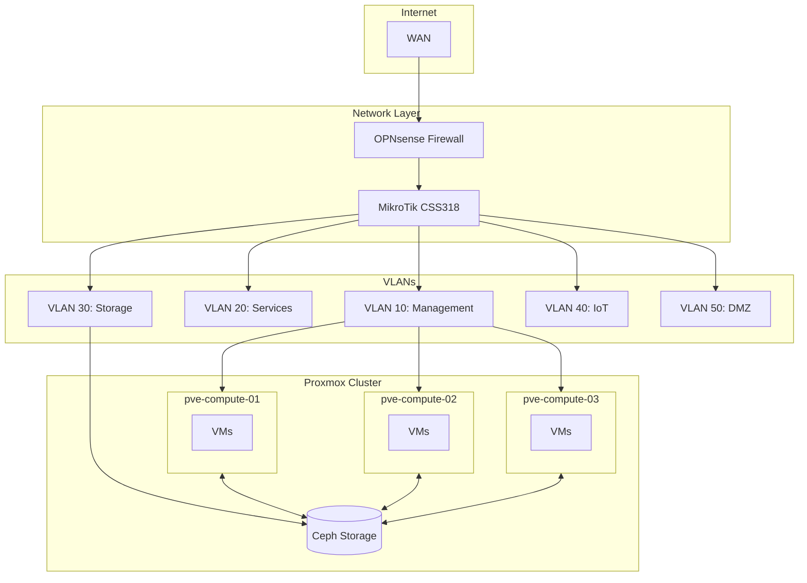

# Homelab Infrastructure

[](https://opentofu.org/)
[](https://www.proxmox.com/)
[](LICENSE)

Infrastructure as Code for automating a home Proxmox cluster using OpenTofu.

## Architecture Overview



## Hardware

| Component | Model | Quantity |
|-----------|-------|----------|
| Compute Nodes | HP Elite Mini 800 G9 | 3 |
| Storage | Ceph (distributed) | — |
| Firewall | OPNsense | 1 |
| Switch | MikroTik CSS318 + Kinetic | 1 |

## What's Included

- `opentofu/single_vm/` — Create one or more identical VMs
- `opentofu/multiple_vm/` — Create multiple VMs with individual parameters
- `proxmox-scripts/` — Utilities for cluster management

## OpenTofu Configurations

### single_vm

Basic configuration for deploying one or more identical VMs with automatic distribution across nodes.

**Features:**
- DHCP for IP address assignment
- Automatic VM ID numbering
- Same CPU/RAM parameters for all VMs

**Usage:**
```bash
cd opentofu/single_vm
cp terraform.tfvars.example terraform.tfvars
vim terraform.tfvars  # configure vm_count and parameters
tofu init && tofu apply
```

Details: [opentofu/single_vm/README.md](opentofu/single_vm/README.md)

### multiple_vm

Advanced configuration for deploying multiple VMs with individual parameters.

**Features:**
- Static IP addresses for each VM
- Fixed VM IDs
- Individual CPU/RAM/tag configuration
- Explicit node placement
- Uses `for_each` for flexible management

**Example usage:**
```bash
cd opentofu/multiple_vm
cp terraform.tfvars.example terraform.tfvars
vim terraform.tfvars  # configure vms block
tofu init && tofu apply
```

**Example VM configuration:**
```hcl
vms = {
  "vm-01-small" = {
    vm_id       = 121
    name        = "vm-01-small"
    node        = "pve-compute-01"
    ip_address  = "10.0.10.21"
    cpu_cores   = 2
    memory_mb   = 4096
    description = "Small VM"
    tags        = ["small"]
  }
  # ... more VMs
}
```

Details: [opentofu/multiple_vm/README.md](opentofu/multiple_vm/README.md)

## Configuration Comparison

| Parameter | single_vm | multiple_vm |
|-----------|-----------|-------------|
| IP addresses | DHCP | Static |
| VM ID | Automatic | Fixed |
| Parameters | Identical | Individual |
| Management | `count` | `for_each` |
| Use case | Quick creation | Precise configuration |

## Requirements

- OpenTofu >= 1.10.x
- Proxmox VE 9.x
- Proxmox API token
- Cloud-init template (instructions in configuration READMEs)

## Quick Start

```bash
# Clone the repository
git clone https://github.com/rtxnik/homelab.git
cd homelab

# Create cloud-init template on Proxmox node
ssh root@pve-compute-01 'bash -s' < proxmox-scripts/create-ubuntu-template.sh

# Choose the desired configuration
cd opentofu/single_vm    # or multiple_vm

# Configure parameters
cp terraform.tfvars.example terraform.tfvars
vim terraform.tfvars

# Deploy VMs
tofu init
tofu plan
tofu apply
```

## Scripts

Utilities for Proxmox in `proxmox-scripts/`:
- `create-ubuntu-template.sh` — Create Ubuntu 22.04 cloud-init template
- `create-rocky9-template.sh` — Create Rocky Linux 9 cloud-init template

## Repository Structure

```
homelab/
├── README.md
├── CHANGELOG.md
├── LICENSE
├── .gitignore
├── .gitmessage
├── opentofu/
│   ├── single_vm/
│   │   ├── README.md
│   │   ├── main.tf
│   │   ├── variables.tf
│   │   ├── outputs.tf
│   │   ├── providers.tf
│   │   ├── versions.tf
│   │   └── terraform.tfvars.example
│   └── multiple_vm/
│       ├── README.md
│       ├── main.tf
│       ├── variables.tf
│       ├── outputs.tf
│       ├── providers.tf
│       ├── versions.tf
│       └── terraform.tfvars.example
└── proxmox-scripts/
    ├── README.md
    ├── create-ubuntu-template.sh
    └── create-rocky9-template.sh
```

## Roadmap

1. **Kubernetes cluster:** Use multiple_vm to create master/worker nodes
2. **Ansible integration:** Automatic inventory generation from OpenTofu outputs
3. **Monitoring:** Prometheus/Grafana stack on dedicated VMs
4. **Storage:** Longhorn for persistent volumes in Kubernetes

## License

MIT

---

**Useful Links:**
- [Proxmox VE Documentation](https://pve.proxmox.com/wiki/Main_Page)
- [OpenTofu Documentation](https://opentofu.org/docs/)
- [bpg/proxmox Provider](https://registry.terraform.io/providers/bpg/proxmox/latest/docs)
